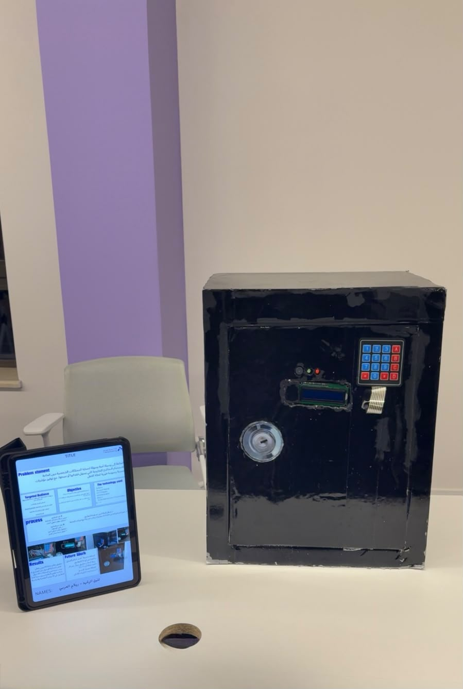

# smart-safe
Arduino based smart safe project

# About the project
The safe uses a keypad to enter a password.
If the password is correct, the door opens.
If the password is wrong, the buzzer gives an alert.

# Components
- Arduino
- Keypad
- LCD
- Buzzer
- Servo motor

# What I learned
- Arduino programming
- Connecting electronic components
- Using a keypad and LCD
- Problem solving

